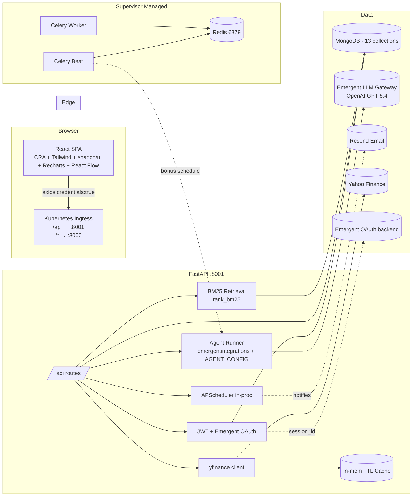
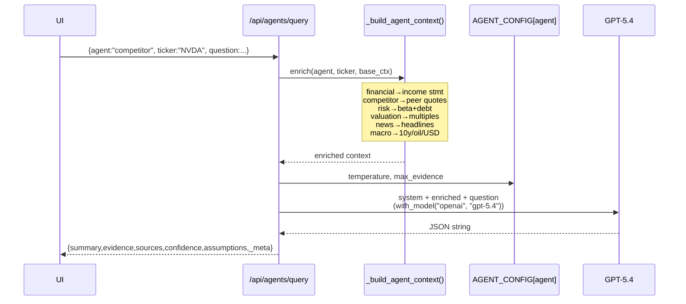
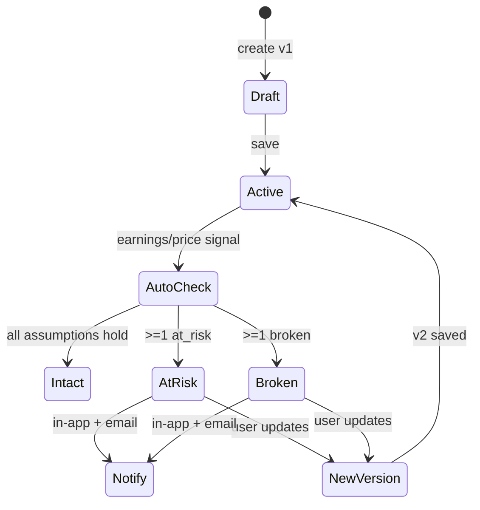
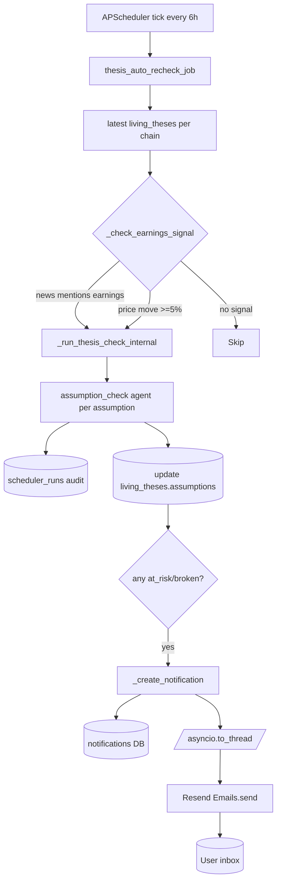
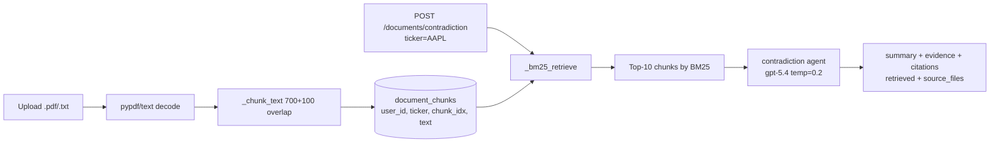
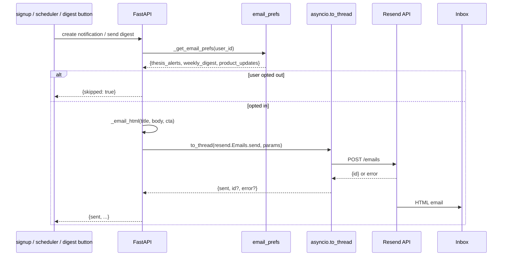

# IntelligenceOS — Technical PRD & Architecture Guide

> **Version:** 2.0
> **Stack:** FastAPI + React (CRA + Tailwind + shadcn/ui) + MongoDB + Redis + Celery + Emergent LLM (GPT‑5.4)
> **Scope:** AI investment intelligence platform — 18 differentiated agents, Living Thesis with Assumption Monitor, Decision Journal + Bias Detection, Investment CRM Pipeline, Portfolio Intelligence (Hidden Connections + Macro Exposure), TradingView-style multi-asset Board, Attractiveness Score + Buy/Sell/Hold ratings, cross-document RAG contradiction detection, Timeline, background scheduler, Resend email.

This document is the single source of truth for the codebase. It covers architecture, data flow, agent prompts, every screen, every API, env config, infra runtime, and how to extend the template.

---

## 1. Product Overview

### 1.1 What it is
IntelligenceOS is a Bloomberg-terminal-inspired dark-theme web app for professional/retail investors, analysts, and small funds. It stitches together the ten gaps competitor products haven't:

- **Multi-asset Board** (Stocks · Crypto · ETFs) with sparklines, sortable columns, 9 chart periods
- **Attractiveness Score + Buy/Sell/Hold** ratings across a universe
- **18 differentiated AI agents** (each with its own model temperature and real-time context enrichment)
- **Living Thesis** with assumptions, catalysts, risks, version chain, and auto-recheck
- **Assumption Monitor** — AI labels each assumption INTACT / AT-RISK / BROKEN
- **Decision Journal + Bias Detector**
- **Investment CRM Pipeline** (Kanban)
- **Portfolio Intelligence** — Hidden Connections + Macro Exposure Map
- **Timeline** unifying news, journal, and thesis versions per ticker
- **RAG Contradiction** across uploaded filings/transcripts
- **AI Writing Assist** on every text surface
- **Background scheduler** auto-checking theses on earnings/price events, with in-app + email notifications

### 1.2 Non-goals (v2)
- Streaming quotes over WebSocket (cache-based instead)
- Real Stripe billing (UI only)
- Multi-region deploy
- Team invite emails (planned)
- Semantic vector search (Atlas required)

---

## 2. High-Level Architecture



**Runtime processes** (supervisor):
| Process | Role |
|---|---|
| `backend` | FastAPI uvicorn on :8001 |
| `frontend` | CRA dev server on :3000 |
| `mongodb` | Primary datastore |
| `redis` | Celery broker/backend (:6379) |
| `celery_worker` | Executes Celery tasks |
| `celery_beat` | Cron-like scheduler (bonus; APScheduler is primary) |

---

## 3. Repository Layout

```
/app
├── backend/
│   ├── server.py            # Single FastAPI app, all routes (~1850 lines)
│   ├── celery_tasks.py      # Celery beat config + task wrappers
│   ├── requirements.txt
│   ├── tests/               # 25 pytest modules, 130 tests
│   └── .env
├── frontend/
│   ├── src/
│   │   ├── App.js           # Router (public + protected)
│   │   ├── index.css        # Design tokens + fonts
│   │   ├── lib/api.js       # Axios (credentials + JWT + public-route allowlist)
│   │   ├── contexts/AuthContext.jsx
│   │   ├── components/
│   │   │   ├── Layout.jsx           # Sidebar + topbar
│   │   │   ├── CommandPalette.jsx   # ⌘K
│   │   │   ├── AIPanel.jsx          # 5-tab agent result
│   │   │   ├── AIAssist.jsx         # Universal writing assistant
│   │   │   ├── NotificationBell.jsx
│   │   │   ├── LivingThesis.jsx     # Full thesis editor + monitor
│   │   │   ├── PortfolioIntelligence.jsx
│   │   │   ├── ProtectedRoute.jsx
│   │   │   └── ui/                  # shadcn primitives
│   │   └── pages/
│   │       ├── Landing.jsx          # /welcome — public marketing
│   │       ├── Login.jsx
│   │       ├── AuthCallback.jsx
│   │       ├── CommandCenter.jsx    # / — dashboard
│   │       ├── Board.jsx            # /board — TradingView-style
│   │       ├── Ratings.jsx          # /ratings — Buy/Sell/Hold
│   │       ├── Markets.jsx
│   │       ├── CompanyDetail.jsx    # /company/:ticker
│   │       ├── Portfolio.jsx
│   │       ├── Pipeline.jsx         # /pipeline — Kanban
│   │       ├── Journal.jsx          # /journal — Decision Journal
│   │       ├── Timeline.jsx         # /timeline/:ticker
│   │       ├── Research.jsx         # Notebook
│   │       ├── AIAgents.jsx         # Playground
│   │       ├── Screeners.jsx
│   │       ├── Valuation.jsx
│   │       ├── Documents.jsx        # Upload + RAG + Contradiction
│   │       ├── Alerts.jsx
│   │       ├── KnowledgeGraph.jsx
│   │       ├── Team.jsx
│   │       └── Settings.jsx         # Plans + Scheduler + Email prefs
│   └── .env
├── design_guidelines.json
├── TECHNICAL_GUIDE.md
├── auth_testing.md
└── memory/
    ├── PRD.md
    └── test_credentials.md
```

Supervisor configs (added at `/etc/supervisor/conf.d/`):
- `redis.conf` — Redis daemon
- `celery.conf` — celery_worker + celery_beat

---

## 4. Environment Variables

### 4.1 `/app/backend/.env`
| Key | Purpose |
|---|---|
| `MONGO_URL` | Mongo connection |
| `DB_NAME` | Database name |
| `CORS_ORIGINS` | Allowed origins |
| `JWT_SECRET` | HS256 sign secret |
| `EMERGENT_LLM_KEY` | Universal LLM key |
| `LLM_MODEL` | Default model (e.g. `gpt-5.4`) |
| `REDIS_URL` | Celery broker/backend |
| `RESEND_API_KEY` | Resend API key (email) |
| `RESEND_FROM` | Sender identity (e.g. `IntelligenceOS <onboarding@resend.dev>`) |
| `APP_URL` | Public URL used for email CTAs |
| `USE_CELERY_BEAT` | Optional flag (`1` disables APScheduler in favor of Celery) |

### 4.2 `/app/frontend/.env`
| Key | Purpose |
|---|---|
| `REACT_APP_BACKEND_URL` | Public backend URL |
| `WDS_SOCKET_PORT` | HMR socket |

---

## 5. MongoDB Collections

| Collection | New in v2 | Purpose |
|---|---|---|
| `users` | | Auth + plan + role |
| `user_sessions` | | Emergent OAuth session cookies |
| `watchlists` | (legacy) | Pre-v2 primary watchlist |
| `watchlist_lists` | ✅ | Multi-asset lists (stocks/crypto/etfs) with default_tickers + user_tickers |
| `holdings` | | Portfolio positions |
| `notes` | | Research notebook |
| `theses` | | Legacy simple thesis (kept for backward compat) |
| `living_theses` | ✅ | Assumptions/catalysts/risks/versions/confidence |
| `journal_entries` | ✅ | Decision Journal with post-mortems |
| `pipeline_items` | ✅ | Investment CRM Kanban |
| `alert_rules` | | Price/news rule alerts |
| `notifications` | ✅ | In-app notifications (emails fired via Resend) |
| `scheduler_runs` | ✅ | Audit log of auto-recheck events |
| `documents` | | Uploaded filings/transcripts |
| `document_chunks` | ✅ | 700-word chunks for BM25 retrieval |
| `agent_runs` | | Every LLM call audited |
| `email_prefs` | ✅ | Per-user email opt-in/out |

All datetimes stored as UTC ISO strings. Every query projects `{_id: 0}`.

---

## 6. Authentication

Unchanged from v1 (dual JWT + Emergent OAuth in `get_current_user`). New in v2:

- **Public-route allowlist** in axios 401 interceptor (`/welcome`, `/login`, `/signup`, `/auth/callback`) — prevents landing-page redirect loop.
- **Welcome email** fired via `asyncio.create_task` on signup — non-blocking.
- **Login page** now redirects already-authenticated users to `/`.

```mermaid
flowchart TD
  V[Visitor hits /] --> P{Authed?}
  P -- yes --> D[CommandCenter]
  P -- no --> W[/welcome — Landing]
  W --> S[Sign up]
  W --> L[Sign in]
  S --> API[POST /api/auth/signup]
  API --> WE[asyncio task<br/>send welcome email]
  API --> T[Return JWT]
  T --> D
```

---

## 7. Backend API Reference (all under `/api`)

### 7.1 Auth
| Method | Path | Notes |
|---|---|---|
| POST | `/auth/signup` | + fires welcome email (fire-and-forget) |
| POST | `/auth/login` | |
| POST | `/auth/oauth/session` | Emergent OAuth exchange |
| GET | `/auth/me` | |
| POST | `/auth/logout` | |

### 7.2 Market Data
| Method | Path | Notes |
|---|---|---|
| GET | `/market/overview` | Indices + 11 sector ETFs |
| GET | `/market/quote/{ticker}` | |
| GET | `/market/quotes?tickers=` | Bulk |
| GET | `/market/history/{ticker}?period=` | **9 periods**: `1d,5d,1mo,ytd,6mo,1y,5y,10y,max` |
| GET | `/market/brief` | AI market strategist agent |
| GET | `/search?q=` | Universal search |

### 7.3 Company
| Method | Path | Notes |
|---|---|---|
| GET | `/company/{ticker}/profile` | |
| GET | `/company/{ticker}/financials` | |
| GET | `/company/{ticker}/news` | ✅ **Relevance-filtered** by ticker/company name |
| GET | `/company/{ticker}/score` | ✅ **Attractiveness Score** — value/momentum/quality/sentiment |

### 7.4 Ratings & Watchlists
| Method | Path | Notes |
|---|---|---|
| POST | `/ratings` | ✅ Bulk score + BUY/HOLD/SELL for a ticker list + optional AI rationale |
| GET | `/watchlist` | Backward-compatible (stocks list) |
| GET | `/watchlist/lists` | ✅ Multi-asset (stocks/crypto/etfs) with plan cap |
| POST | `/watchlist/add` | ✅ Body `{asset_class, ticker}` — enforces **Free plan cap (5 additional/list)** |
| POST | `/watchlist/remove` | |

### 7.5 Portfolio
| Method | Path | Notes |
|---|---|---|
| GET | `/portfolio` | Holdings + KPIs + health_score |
| POST | `/portfolio/add` | |
| DELETE | `/portfolio/{holding_id}` | |
| GET | `/portfolio/brief` | AI Daily Brief |
| GET | `/portfolio/connections` | ✅ AI Hidden Connections (thesis clusters) |
| GET | `/portfolio/macro` | ✅ Macro Exposure Map (rates/oil/AI/china/…) |
| POST | `/portfolio/digest/send` | ✅ Weekly digest via Resend (respects prefs) |

### 7.6 Living Thesis
| Method | Path | Notes |
|---|---|---|
| GET | `/thesis/living?ticker=` | Latest per chain |
| POST | `/thesis/living` | Body includes assumptions, catalysts, risks, confidence, price_target, horizon, optional parent_id |
| GET | `/thesis/living/{id}` | |
| GET | `/thesis/living/{id}/history` | Full version chain |
| GET | `/thesis/living/{id}/diff` | ✅ "What Changed?" between last two versions |
| POST | `/thesis/living/{id}/check` | ✅ AI assumption-check → INTACT/AT_RISK/BROKEN per assumption |
| GET | `/thesis/legacy/{ticker}` | Backward-compat simple thesis list |

### 7.7 Decision Journal
| Method | Path | Notes |
|---|---|---|
| GET | `/journal` | List entries |
| POST | `/journal` | Auto-captures price at decision |
| POST | `/journal/{id}/postmortem` | Right/wrong/partial + lessons |
| DELETE | `/journal/{id}` | |
| GET | `/journal/analyze` | ✅ Bias detection agent |

### 7.8 Investment CRM Pipeline
| Method | Path | Notes |
|---|---|---|
| GET | `/pipeline` | Grouped by 7 stages |
| POST | `/pipeline` | |
| POST | `/pipeline/move` | Advances a card + audit trail |
| DELETE | `/pipeline/{id}` | |

Stages: `idea → research → validation → buy → monitor → review → archive`.

### 7.9 Alerts + Timeline + Graph
| Method | Path | Notes |
|---|---|---|
| GET | `/alerts` | Rules + fires |
| POST | `/alerts` | |
| DELETE | `/alerts/{id}` | |
| GET | `/timeline/{ticker}` | ✅ Unified: news + journal + theses |
| GET | `/graph/{ticker}` | React Flow nodes/edges |

### 7.10 AI Agents
| Method | Path | Notes |
|---|---|---|
| POST | `/agents/query` | Body `{agent, ticker?, question}` |
| POST | `/agents/assist` | ✅ Universal writing helper. Body `{context_type, current_text, ticker?, instruction}` |

### 7.11 Documents (RAG)
| Method | Path | Notes |
|---|---|---|
| POST | `/documents/upload?ticker=` | ✅ Chunks 700 words + 100 overlap; stores in `document_chunks` |
| GET | `/documents` | |
| DELETE | `/documents/{id}` | Cascades to chunks |
| POST | `/documents/{id}/ask` | Scoped BM25 within one doc |
| POST | `/documents/contradiction` | ✅ Cross-doc BM25 → contradiction agent with citations |

### 7.12 Screener / Valuation
| Method | Path | Notes |
|---|---|---|
| POST | `/screener/run` | NL query + filters (min_cap, max_pe, sector) |
| POST | `/valuation/dcf` | Full DCF + Bull/Base/Bear scenarios |

### 7.13 Notifications & Email
| Method | Path | Notes |
|---|---|---|
| GET | `/notifications?unread_only=` | ✅ In-app feed |
| POST | `/notifications/{id}/read` | ✅ |
| POST | `/notifications/read-all` | ✅ |
| POST | `/notifications/test-email` | ✅ Delivers to signed-in user |
| GET | `/settings/email-prefs` | ✅ Thesis alerts / weekly digest / product updates |
| PUT | `/settings/email-prefs` | ✅ |

### 7.14 Scheduler & Demo
| Method | Path | Notes |
|---|---|---|
| GET | `/scheduler/status` | Jobs + recent audit runs |
| POST | `/scheduler/run-now` | Manual trigger |
| POST | `/demo/seed` | ✅ Seed 6 journal + 11 pipeline items |
| POST | `/demo/clear` | ✅ Deletes demo-flagged items only |

### 7.15 Team
| Method | Path |
|---|---|
| GET | `/team/members` |

---

## 8. AI Agent System

### 8.1 The 18 agents (all `gpt-5.4`)

| Key | Role | Temperature | Signals injected |
|---|---|---|---|
| `research` | Senior equity analyst | 0.4 | Profile + quote |
| `financial` | CFA — quality of earnings | 0.2 | Income statement (latest 8 fields) |
| `news` | Impact + sentiment | 0.5 | 6 recent headlines |
| `competitor` | Porter · moat · pricing | 0.4 | Peer quotes (up to 3) |
| `risk` | Tail risks + mitigations | 0.3 | beta/shortRatio/debtToEquity/currentRatio |
| `valuation` | DCF · comps · scenario | 0.2 | PE/fwdPE/PS/PB/EV-EBITDA |
| `macro` | Rates · oil · policy | 0.5 | 10y yield · oil · USD index |
| `market_brief` | Daily strategist | 0.6 | Indices + sectors |
| `portfolio_brief` | Daily portfolio strategist | 0.4 | Value/gain/holdings |
| `contradiction` | 10-K vs call vs guidance vs news | 0.2 | BM25 top-10 chunks (cited) |
| `management` | Capital allocation · execution | 0.3 | Profile + summary |
| `materiality` | Signal from noise | 0.3 | Headlines |
| `earnings_diff` | Q/Q line-by-line | 0.2 | Income statement |
| `bias` | Behavioral finance coach | 0.6 | Journal entries |
| `assumption_check` | INTACT/AT_RISK/BROKEN | 0.2 | Ticker snapshot + assumption text |
| `hidden_connections` | Thesis clusters | 0.5 | Holdings + sectors |
| `macro_exposure` | Factor scoring | 0.3 | Portfolio tickers |
| `note_assist` | Writing helper | 0.6 | Optional ticker context |

### 8.2 Two-stage differentiation


Every response includes `_meta: {agent, model, temperature}` for auditability.

### 8.3 Unified JSON contract
All agents return:
```json
{
  "summary": "2-4 sentences",
  "evidence": ["fact 1", "fact 2"],
  "sources": ["yfinance", "SEC 10-K"],
  "confidence": 0-100,
  "assumptions": ["..."],
  "_meta": {"agent": "competitor", "model": "gpt-5.4", "temperature": 0.4}
}
```

### 8.4 Writing Assist flow
```mermaid
flowchart LR
  T[Any textarea in the app] --> A[<AIAssist> component]
  A -->|context_type + current_text| E[/api/agents/assist]
  E --> G[Prompt guide by type<br/>note · thesis · journal_reason · journal_expected · catalyst · risk · assumption]
  G --> LLM[GPT-5.4 note_assist]
  LLM --> S[Suggestion card]
  S -->|Apply| T
  S -->|Reject| Discard
```

Live on: Research notebook, Journal (reason + expected outcome), Living Thesis narrative.

---

## 9. Screen-by-Screen (v2)

### 9.1 Public routes
- `/welcome` — Landing (hero, 18-agent grid, 6 features, 4-tier pricing, sticky nav)
- `/login`, `/signup` — auto-redirect if authed
- `/auth/callback` — Emergent OAuth exchange

### 9.2 Protected routes
| Route | Page | Highlights |
|---|---|---|
| `/` | CommandCenter | Add Ticker button, indices, SPY chart, sector heatmap, watchlist, AI Market Brief |
| `/board` | Board | Tabs Stocks · Crypto · ETFs · sparklines · plan cap banner |
| `/ratings` | Ratings | 5 universe presets · sortable · component bars · AI rationale toggle |
| `/markets` | Markets | Search + indices/sectors tables |
| `/company/:ticker` | CompanyDetail | Score badge + 4-component panel · **9 chart periods** · 12 agents tab · Living Thesis tab |
| `/portfolio` | Portfolio | Sortable holdings · donut · AI brief · Hidden Connections · Macro Exposure |
| `/pipeline` | Pipeline | 7-stage Kanban · Load Sample button |
| `/journal` | Journal | Decisions + post-mortems + Detect Biases + Load Sample |
| `/timeline/:ticker` | Timeline | News + journal + thesis events on one thread |
| `/research` | Research | Notebook + AI Assist |
| `/agents` | AIAgents | 12-agent playground |
| `/screeners` | Screeners | 5 NL presets · saved screens · sortable |
| `/valuation` | Valuation | Full DCF + Bull/Base/Bear |
| `/documents` | Documents | Upload with ticker · scoped ask · **Cross-doc Contradiction** |
| `/alerts` | Alerts | Rule builder |
| `/graph` | KnowledgeGraph | React Flow |
| `/team` | Team | Members roster |
| `/settings` | Settings | Account · **Email prefs + test-send + digest** · Scheduler status · Plans |

Top-bar: **CMD+K palette · live market indicator · Notification Bell**.

---

## 10. Living Thesis Lifecycle



`/thesis/living/{id}/diff` compares last two versions and returns added/removed/changed for assumptions, catalysts, risks, headline, narrative, stance, confidence, price_target.

---

## 11. Background Scheduler



**Dual scheduler**: APScheduler is primary (in-process). Celery beat is bonus for horizontal scale (`celery_tasks.py`). Both invoke the same `thesis_auto_recheck_job`; `max_instances=1 + coalesce=True` prevents overlap.

---

## 12. RAG Pipeline (Cross-Document Contradiction)



**Upgrade path** (Atlas): swap `_bm25_retrieve` with a `$vectorSearch` aggregation on `document_chunks.embedding` — endpoint contract unchanged.

---

## 13. Attractiveness Score

Deterministic (no LLM), fast, cacheable. Weights:
- Value 35% (P/E normalized)
- Momentum 25% (52w range position, penalty >0.9)
- Quality 25% (β distance from 1 + dividend bonus)
- Sentiment 15% (today's %change)

Rating tiers: `≥75 STRONG_BUY · ≥60 BUY · ≥45 HOLD · ≥30 SELL · <30 STRONG_SELL`.

Consumed by:
- `/company/{ticker}/score`
- `/ratings` (bulk)
- Score badge in `CompanyDetail` header
- Score panel with 4 component bars

---

## 14. Email (Resend)



**Templates** (`_email_html`): dark-themed, inline CSS only (email-client safe), optional orange CTA button. Sender defaults to `onboarding@resend.dev` sandbox — verify a domain in Resend for prod deliverability.

**Endpoints**:
- `GET /settings/email-prefs` (auto-creates defaults on first read)
- `PUT /settings/email-prefs`
- `POST /notifications/test-email` — user-facing sanity check
- `POST /portfolio/digest/send` — weekly digest with real AI brief + top-10 holdings table

**Failure mode**: If Resend rejects (invalid key, rate limit, etc.), endpoint returns `200 {sent: false, error: "..."}` — never `500`. Notification is still stored in DB. Signup never blocks on email.

---

## 15. Design System (unchanged)

- Fonts: Inter (UI), JetBrains Mono (data)
- Colors: Base `#090A0C` · Panel `#121418` · Terminal orange `#F97316` · Insight indigo `#818CF8` · positive/negative/warning semantic
- Radius `rounded-md` (6px), no shadows on dark
- **Fixed in v2**: shadcn `Input` now has `text-foreground` (was black-on-black bug)

---

## 16. Deployment Notes

```
sudo supervisorctl status
  backend           RUNNING
  frontend          RUNNING
  mongodb           RUNNING
  redis             RUNNING     # new in v2
  celery_worker     RUNNING     # new in v2
  celery_beat       RUNNING     # new in v2
```

Restart backend on `.env` change: `sudo supervisorctl restart backend`.
Restart workers on Celery task change: `sudo supervisorctl restart celery_worker celery_beat`.

---

## 17. Testing

- 25 pytest modules under `/app/backend/tests/`
- **130 tests passing** as of iteration_8
- Fresh isolated users per test via `conftest.py` (`TEST_iops_*@example.com`)
- No external mocks — real yfinance, real GPT-5.4, real Redis, real Resend (graceful when key invalid)

Test priority matrix:
| Area | Coverage |
|---|---|
| Auth | signup/login/duplicate/JWT/OAuth stub |
| Market | overview/quote/history 9 periods |
| Company | profile/financials/news relevance/score |
| Ratings | bulk + AI rationale |
| Watchlist | multi-asset + plan cap |
| Portfolio | KPIs + connections + macro + brief |
| Living Thesis | CRUD + check + diff + history |
| Journal | CRUD + postmortem + bias analyze |
| Pipeline | CRUD + move + audit |
| Documents | upload chunks + contradiction |
| Agents | 18 agent keys + _meta.model + differentiation |
| Scheduler | status + run-now |
| Notifications | list + read + prefs |
| Email | test-email + digest opt-out + graceful invalid key |
| Landing | /welcome public + 401 no redirect loop |

---

## 18. Extension Recipes

### 18.1 Add a new agent
1. Add key + system prompt to `AGENT_SYSTEM`
2. Add config to `AGENT_CONFIG` (model, temperature, max_evidence)
3. Optionally extend `_build_agent_context()` with new signal enrichment
4. Add to `AGENTS` list in `AIAgents.jsx` and `CompanyDetail.jsx`

### 18.2 Add a new endpoint
1. Add Pydantic model + `@api.<verb>("/…")` handler in `server.py`
2. Depend on `get_current_user`
3. `{_id: 0}` projection
4. ISO datetime strings

### 18.3 Enable Celery beat as primary scheduler
1. Ensure `redis-server` running (already via supervisor)
2. Set `USE_CELERY_BEAT=1` in `.env`
3. Restart backend — APScheduler will skip, Celery beat takes over

### 18.4 Move RAG to Atlas $vectorSearch
1. Point `MONGO_URL` at Atlas cluster
2. Create vector index on `document_chunks` with field `embedding` (OpenAI text-embedding-3-small, 1536 dims)
3. Extend `upload_doc` to compute + store embedding per chunk
4. Replace `_bm25_retrieve` body with `$vectorSearch` aggregation
5. Endpoint contract stays unchanged

---

## 19. Known Limitations

- yfinance is unofficial; rate-limits occasionally return null quotes
- Confidence scores are LLM self-reported, not calibrated
- Alert rules are stored but not evaluated by a live worker yet (only assumption-check scheduler runs)
- Knowledge Graph peers are hardcoded for a handful of mega-caps; generic fallback otherwise
- Resend sandbox sender (`onboarding@resend.dev`) can only deliver to the Resend account owner in production — verify a real domain for full deliverability
- Local Mongo does not support `$vectorSearch` — BM25 is the retrieval today

---

## 20. Ownership Map

| Area | Files |
|---|---|
| Auth | `server.py::get_current_user`, `AuthContext`, `AuthCallback`, `api.js` interceptor |
| Agents | `AGENT_SYSTEM`, `AGENT_CONFIG`, `run_agent`, `_build_agent_context`, `AIPanel` |
| Living Thesis | `/thesis/living/*`, `LivingThesis.jsx`, `scheduler_runs` |
| Scheduler | `thesis_auto_recheck_job`, `_check_earnings_signal`, `celery_tasks.py`, supervisor confs |
| RAG | `_chunk_text`, `_bm25_retrieve`, `document_chunks` collection |
| Email | `_email_html`, `_send_email`, `email_prefs`, `Settings.jsx` |
| Attractiveness Score | `_compute_score`, `/company/{ticker}/score`, `/ratings`, score badge + panel |
| Landing | `Landing.jsx`, public-route allowlist in `api.js` |

---

## 21. Appendix — Full Agent System Prompts

Base contract appended to every agent:
> "You MUST respond in strict JSON with these keys: summary (string, 2-4 sentences), evidence (array up to N items), sources (array), confidence (0-100), assumptions (array). No markdown. Only JSON."

Per-agent system messages (verbatim from `AGENT_SYSTEM` in `server.py`):
```
research:            "Senior equity research analyst — concise, structured analysis"
financial:           "CFA — financials, ratios, quality of earnings"
news:                "News impact analyst — materiality, sentiment"
competitor:          "Porter's Five Forces + moat analysis"
risk:                "Risk analyst — tail risks and mitigations"
valuation:           "DCF, comps, scenario logic"
macro:               "Macro strategist — impacts on the asset"
market_brief:        "Market strategist writing the AI Market Brief"
portfolio_brief:     "Portfolio strategist writing the daily brief"
contradiction:       "Compare claims across 10-K, calls, guidance, news"
management:          "Capital allocation + execution scoring"
materiality:         "News materiality 0-100 (signal vs noise)"
earnings_diff:       "Line-by-line quarter comparison"
bias:                "Behavioral finance coach over the Decision Journal"
assumption_check:    "INTACT / AT_RISK / BROKEN verdict"
hidden_connections:  "Cluster holdings by shared drivers (not sectors)"
macro_exposure:      "Score 0-100 exposure to rates/oil/china/AI/…"
note_assist:         "Investment writing assistant (rewrite / improve)"
```

---

*End of document. Version 2.0 — supersedes v1.0.*
