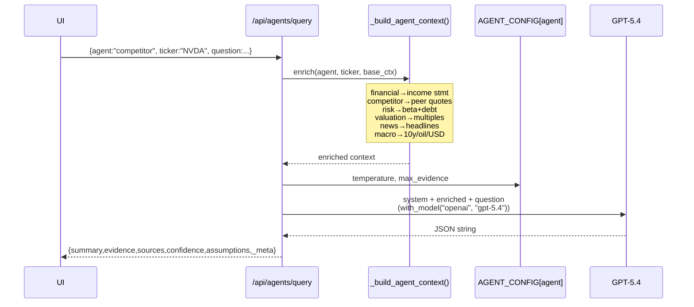
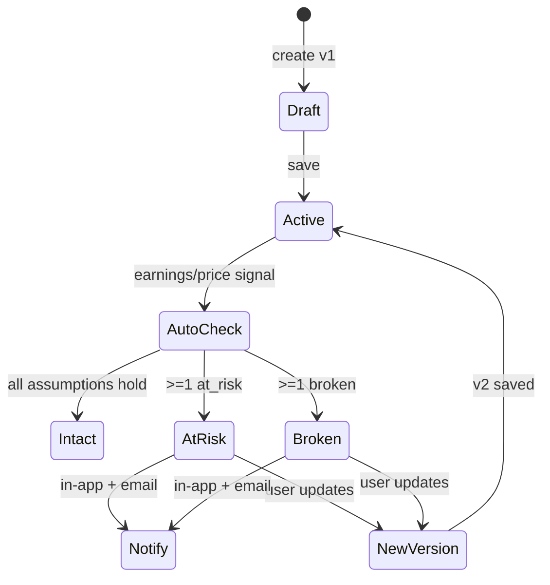
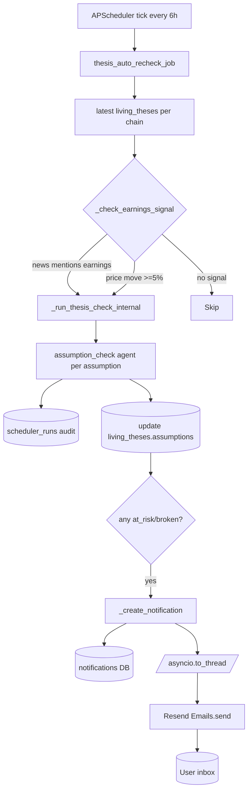
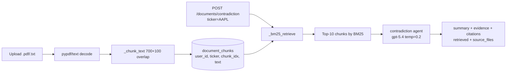
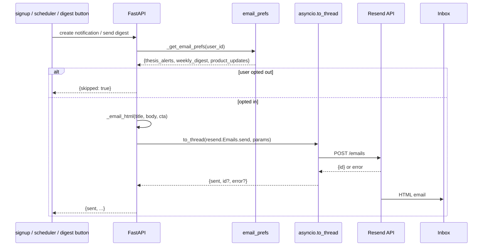

# IntelligenceOS — Technical PRD & Architecture Guide

> **Version:** 2.2
> **Stack:** FastAPI + React (CRA + Tailwind + shadcn/ui) + MongoDB + Redis + Celery + OpenAI LLM (default `gpt-5-nano`)
> **Scope:** AI investment intelligence platform — 18 differentiated agents, Living Thesis with Assumption Monitor, Decision Journal + Bias Detection, Investment CRM Pipeline, Portfolio Intelligence (Hidden Connections + Macro Exposure), TradingView-style multi-asset Board, Attractiveness Score + Buy/Sell/Hold ratings, cross-document RAG contradiction detection, Timeline, background scheduler, Resend email, **go-live security hardening + deployment-env-driven configuration (no physical `.env` dependency)**.

This document is the single source of truth for the codebase. It covers architecture, data flow, agent prompts, every screen, every API, env config, infra runtime, and how to extend the template.

---

## 1. Product Overview

### 1.1 What it is
IntelligenceOS is a Bloomberg-terminal-inspired dark-theme web app for professional/retail investors, analysts, and small funds. It stitches together the ten gaps competitor products haven't:

- **Multi-asset Board** (Stocks · Crypto · ETFs) with sparklines, sortable columns, 9 chart periods
- **Attractiveness Score + Buy/Sell/Hold** ratings across a universe
- **18 differentiated AI agents** (each with its own model temperature and real-time context enrichment)
- **Living Thesis** with assumptions, catalysts, risks, version chain, and auto-recheck
- **Assumption Monitor** — AI labels each assumption INTACT / AT-RISK / BROKEN
- **Decision Journal + Bias Detector**
- **Investment CRM Pipeline** (Kanban)
- **Portfolio Intelligence** — Hidden Connections + Macro Exposure Map
- **Timeline** unifying news, journal, and thesis versions per ticker
- **RAG Contradiction** across uploaded filings/transcripts
- **AI Writing Assist** on every text surface
- **Background scheduler** auto-checking theses on earnings/price events, with in-app + email notifications

### 1.2 Non-goals (v2)
- Streaming quotes over WebSocket (cache-based instead)
- Real Stripe billing (UI only — upgrade button stubs a toast)
- Multi-region deploy
- Team invite emails (planned; Resend is wired for transactional alerts already)
- Semantic vector search (Atlas required)

---

## 2. High-Level Architecture


**Runtime processes** (supervisor):
| Process | Role |
|---|---|
| `backend` | FastAPI uvicorn on :8001 |
| `frontend` | CRA dev server on :3000 |
| `mongodb` | Primary datastore |
| `redis` | Celery broker/backend (:6379) |
| `celery_worker` | Executes Celery tasks |
| `celery_beat` | Cron-like scheduler (bonus; APScheduler is primary) |

---

## 3. Repository Layout

```
/app
├── backend/
│   ├── server.py            # Single FastAPI app, all routes (~1910 lines)
│   ├── celery_tasks.py      # Celery beat config + task wrappers (opt-in)
│   ├── requirements.txt
│   ├── pytest.ini
│   ├── tests/               # 27 pytest modules
│   ├── .env                 # committed placeholder (empty values, no secrets)
│   └── .env.example         # tracked template with docs/examples
├── frontend/
│   ├── src/
│   │   ├── App.js           # Router (public + 17 protected routes)
│   │   ├── index.css        # Design tokens + fonts
│   │   ├── lib/api.js       # Axios (credentials + JWT + public-route allowlist)
│   │   ├── contexts/AuthContext.jsx
│   │   ├── constants/testIds/   # Centralized data-testid map
│   │   ├── components/
│   │   │   ├── Layout.jsx           # Sidebar (17 nav items) + topbar
│   │   │   ├── CommandPalette.jsx   # ⌘K
│   │   │   ├── AIPanel.jsx          # 5-tab agent result
│   │   │   ├── AIAssist.jsx         # Universal writing assistant
│   │   │   ├── NotificationBell.jsx
│   │   │   ├── LivingThesis.jsx     # Full thesis editor + monitor
│   │   │   ├── PortfolioIntelligence.jsx
│   │   │   ├── ProtectedRoute.jsx
│   │   │   └── ui/                  # shadcn primitives
│   │   └── pages/
│   │       ├── Landing.jsx          # /welcome — public marketing
│   │       ├── Login.jsx            # /login + /signup (mode prop)
│   │       ├── AuthCallback.jsx
│   │       ├── CommandCenter.jsx    # / — dashboard
│   │       ├── Board.jsx            # /board — TradingView-style multi-asset
│   │       ├── Ratings.jsx          # /ratings — Buy/Sell/Hold
│   │       ├── Markets.jsx
│   │       ├── CompanyDetail.jsx    # /company/:ticker (11-agent tab)
│   │       ├── Portfolio.jsx
│   │       ├── Pipeline.jsx         # /pipeline — Kanban
│   │       ├── Journal.jsx          # /journal — Decision Journal
│   │       ├── Timeline.jsx         # /timeline/:ticker
│   │       ├── Research.jsx         # Notebook
│   │       ├── AIAgents.jsx         # Playground (12 selectable agents)
│   │       ├── Screeners.jsx
│   │       ├── Valuation.jsx
│   │       ├── Documents.jsx        # Upload + RAG + Contradiction
│   │       ├── Alerts.jsx
│   │       ├── KnowledgeGraph.jsx
│   │       ├── Team.jsx
│   │       └── Settings.jsx         # Plans + Scheduler + Email prefs
│   ├── .env                # committed placeholder (empty values, no secrets)
│   └── .env.example        # tracked template
├── design_guidelines.json
├── TECHNICAL_GUIDE.md      # THIS FILE (canonical, v2.2 — single source of truth)
├── auth_testing.md
└── memory/
    └── PRD.md
```

> **Supervisor configs** (added at `/etc/supervisor/conf.d/`): `redis.conf`, `celery.conf` (worker + beat). See §16.

---

## 4. Environment Variables

> **The backend does NOT require a physical `.env` file to run.** All config is read from `os.environ` (the deployment environment). `load_dotenv()` is called for local-dev convenience only — it silently skips a missing file and never overwrites existing env vars (so platform-injected values always win).
>
> **File layout:**
> - `backend/.env` — **committed** to git with **empty values only** (variable names as placeholders). Exists so the Emergent platform's `PullSource`/build step can read the variable manifest. Contains NO secrets.
> - `backend/.env.example` — committed template with documentation and example values for local dev.
> - `frontend/.env` — committed with `REACT_APP_BACKEND_URL` + `WDS_SOCKET_PORT` (no secrets; CRA build-time injection).
> - `frontend/.env.example` — committed template.
>
> Both `.env` files are gitignored for **local overrides** (when a developer copies `.env.example` → `.env` and fills in real values). The committed placeholder `.env` files are explicitly un-ignored via `!backend/.env` in `.gitignore`.

### 4.1 `/app/backend/.env` — deployment env vars
| Key | Source | Default | Notes |
|---|---|---|---|
| `MONGO_URL` | deployment env | `''` (required at runtime) | Mongo connection string. Platform injects. |
| `DB_NAME` | deployment env | `intelligenc_os` | Database name. |
| `JWT_SECRET` | deployment env | `''` (required) | **≥32 chars.** App refuses to boot otherwise; `ALLOW_WEAK_JWT=1` overrides for local dev. |
| `CORS_ORIGINS` | deployment env | `''` | Comma-separated explicit origins. **Never `*` with credentials.** Empty = fail-closed. |
| `OPENAI_API_KEY` | deployment env | `''` | Primary LLM key. Falls back to legacy `EMERGENT_LLM_KEY` for local dev. |
| `OPENAI_MODEL` | deployment env | `gpt-5-nano` | Primary model. Falls back to legacy `LLM_MODEL`. |
| `EMERGENT_LLM_KEY` | local dev | `''` | Legacy alias — `OPENAI_API_KEY` takes precedence. |
| `LLM_MODEL` | local dev | `gpt-5-nano` | Legacy alias — `OPENAI_MODEL` takes precedence. |
| `REDIS_URL` | deployment env | `redis://localhost:6379/0` | Celery broker/backend. |
| `RESEND_API_KEY` | deployment env | `''` | Resend API key. Optional; endpoints degrade gracefully. |
| `RESEND_FROM` | deployment env | `IntelligenceOS <onboarding@resend.dev>` | Sender identity. Verify a real domain for prod. |
| `APP_URL` | deployment env | `''` | Public URL for email CTAs. |
| `COOKIE_SECURE` | deployment env | `true` | Set `false` for local http dev. |
| `COOKIE_SAMESITE` | deployment env | `none` | `none` (cross-site OAuth) · `lax` · `strict`. |
| `MAX_UPLOAD_BYTES` | deployment env | `5242880` (5 MB) | Document upload cap; 413 on overflow. |
| `ALLOW_WEAK_JWT` | local dev | unset | `1` bypasses JWT strength check. Never set in prod. |

> **No `USE_CELERY_BEAT` flag exists.** APScheduler always starts in-process (see §11). Celery beat is opt-in by running worker/beat processes.

### 4.2 `/app/frontend/.env`
| Key | Purpose | Notes |
|---|---|---|
| `REACT_APP_BACKEND_URL` | Public backend URL | https, no trailing slash; must be in backend `CORS_ORIGINS`. CRA bakes this at build time. |
| `WDS_SOCKET_PORT` | HMR socket | `443` for Kubernetes ingress. |
| `ENABLE_HEALTH_CHECK` | (unused) | Present in `.env` but not referenced in `src/` — safe to drop. |

---

## 5. MongoDB Collections

| Collection | New in v2 | Purpose |
|---|---|---|
| `users` | | Auth + plan + role |
| `user_sessions` | | Emergent OAuth session cookies |
| `watchlists` | (legacy) | Pre-v2 primary watchlist |
| `watchlist_lists` | ✅ | Multi-asset lists (stocks/crypto/etfs) with default_tickers + user_tickers |
| `holdings` | | Portfolio positions |
| `notes` | | Research notebook |
| `theses` | | Legacy simple thesis (kept for backward compat) |
| `living_theses` | ✅ | Assumptions/catalysts/risks/versions/confidence |
| `journal_entries` | ✅ | Decision Journal with post-mortems |
| `pipeline_items` | ✅ | Investment CRM Kanban |
| `alert_rules` | | Price/news rule alerts |
| `alerts` | | Alert fires (populated when an alert rule triggers) |
| `notifications` | ✅ | In-app notifications (emails fired via Resend) |
| `scheduler_runs` | ✅ | Audit log of auto-recheck events |
| `documents` | | Uploaded filings/transcripts |
| `document_chunks` | ✅ | 700-word chunks for BM25 retrieval |
| `agent_runs` | | Every LLM call audited |
| `email_prefs` | ✅ | Per-user email opt-in/out |

All datetimes stored as UTC ISO strings. Every query projects `{_id: 0}`.

---

## 6. Authentication

Dual JWT + Emergent OAuth in `get_current_user`. v2.1 hardening:

- **JWT claims**: `iss="intelligence-os"`, `sub=user_id`, `iat`, `exp` (7d), `jti` (random). Decoder reads `sub` with backward-compat fallback to legacy `user_id`.
- **JWT_SECRET strength gate**: app refuses to start if secret is missing, <32 chars, or equals the placeholder. `ALLOW_WEAK_JWT=1` overrides for local dev.
- **Password policy** (`validate_password`): min 8 chars, max 128, must include upper + lower + digit. Enforced on `/auth/signup`.
- **Rate limiting** (`_rate_check`, in-memory per-IP): signup 5/10min, login 10/10min → HTTP 429. (Single-process; swap for Redis when scaling beyond 1 worker.)
- **Cookie flags env-gated**: `COOKIE_SECURE` + `COOKIE_SAMESITE` (was hardcoded `secure=True, samesite=none`).
- **Public-route allowlist** in axios 401 interceptor (`/welcome`, `/login`, `/signup`, `/auth/callback`) — prevents landing-page redirect loop.
- **Welcome email** fired via `asyncio.create_task` on signup — non-blocking.
- **Login page** redirects already-authenticated users to `/`.

```mermaid
flowchart TD
  V[Visitor hits /] --> P{Authed?}
  P -- yes --> D[CommandCenter]
  P -- no --> W[/welcome — Landing]
  W --> S[Sign up]
  W --> L[Sign in]
  S --> PV{password policy}
  PV -- fail --> 400
  PV -- pass --> RL{rate limit}
  RL -- over --> 429
  RL -- ok --> API[POST /api/auth/signup]
  API --> WE[asyncio task<br/>send welcome email]
  API --> T[JWT iss/sub/iat/exp/jti]
  T --> D
```

> **Known gap**: JWT is stored in `localStorage` (XSS-exfil risk). Logout does not revoke JWT (no `jti` blocklist). Move to httpOnly cookie + CSRF token for full hardening — see §22.

---

## 7. Backend API Reference (all under `/api`)

### 7.1 Auth
| Method | Path | Notes |
|---|---|---|
| POST | `/auth/signup` | Password policy enforced (§6); rate-limited 5/10min/IP; fires welcome email (fire-and-forget) |
| POST | `/auth/login` | Rate-limited 10/10min/IP |
| POST | `/auth/oauth/session` | Emergent OAuth exchange |
| GET | `/auth/me` | |
| POST | `/auth/logout` | Clears cookie + session row (JWT not revoked — see §22) |

### 7.2 Market Data
| Method | Path | Notes |
|---|---|---|
| GET | `/market/overview` | Indices + 11 sector ETFs |
| GET | `/market/quote/{ticker}` | |
| GET | `/market/quotes?tickers=` | Bulk |
| GET | `/market/history/{ticker}?period=` | **9 periods**: `1d,5d,1mo,ytd,6mo,1y,5y,10y,max` |
| GET | `/market/brief` | AI market strategist agent |
| GET | `/search?q=` | Universal search |

### 7.3 Company
| Method | Path | Notes |
|---|---|---|
| GET | `/company/{ticker}/profile` | |
| GET | `/company/{ticker}/financials` | |
| GET | `/company/{ticker}/news` | ✅ **Relevance-filtered** by ticker/company name |
| GET | `/company/{ticker}/score` | ✅ **Attractiveness Score** — value/momentum/quality/sentiment |

### 7.4 Ratings & Watchlists
| Method | Path | Notes |
|---|---|---|
| POST | `/ratings` | ✅ Bulk score + BUY/HOLD/SELL for a ticker list + optional AI rationale |
| GET | `/watchlist` | Backward-compatible (stocks list) |
| GET | `/watchlist/lists` | ✅ Multi-asset (stocks/crypto/etfs) with plan cap |
| POST | `/watchlist/add` | ✅ Body `{asset_class, ticker}` — enforces **Free plan cap (5 additional/list)** |
| POST | `/watchlist/remove` | |

### 7.5 Portfolio
| Method | Path | Notes |
|---|---|---|
| GET | `/portfolio` | Holdings + KPIs + health_score |
| POST | `/portfolio/add` | |
| DELETE | `/portfolio/{holding_id}` | |
| GET | `/portfolio/brief` | AI Daily Brief |
| GET | `/portfolio/connections` | ✅ AI Hidden Connections (thesis clusters) |
| GET | `/portfolio/macro` | ✅ Macro Exposure Map (rates/oil/AI/china/…) |
| POST | `/portfolio/digest/send` | ✅ Weekly digest via Resend (respects prefs) |

### 7.6 Living Thesis
| Method | Path | Notes |
|---|---|---|
| GET | `/thesis/living?ticker=` | Latest per chain |
| POST | `/thesis/living` | Body includes assumptions, catalysts, risks, confidence, price_target, horizon, optional parent_id |
| GET | `/thesis/living/{id}` | |
| GET | `/thesis/living/{id}/history` | Full version chain |
| GET | `/thesis/living/{id}/diff` | ✅ "What Changed?" between last two versions |
| POST | `/thesis/living/{id}/check` | ✅ AI assumption-check → INTACT/AT_RISK/BROKEN per assumption |
| GET | `/thesis/legacy/{ticker}` | Backward-compat simple thesis list |

### 7.7 Decision Journal
| Method | Path | Notes |
|---|---|---|
| GET | `/journal` | List entries |
| POST | `/journal` | Auto-captures price at decision |
| POST | `/journal/{id}/postmortem` | Right/wrong/partial + lessons |
| DELETE | `/journal/{id}` | |
| GET | `/journal/analyze` | ✅ Bias detection agent |

### 7.8 Investment CRM Pipeline
| Method | Path | Notes |
|---|---|---|
| GET | `/pipeline` | Grouped by 7 stages |
| POST | `/pipeline` | |
| POST | `/pipeline/move` | Advances a card + audit trail |
| DELETE | `/pipeline/{id}` | |

Stages: `idea → research → validation → buy → monitor → review → archive`.

### 7.9 Alerts + Timeline + Graph
| Method | Path | Notes |
|---|---|---|
| GET | `/alerts` | Rules + fires |
| POST | `/alerts` | |
| DELETE | `/alerts/{id}` | |
| GET | `/timeline/{ticker}` | ✅ Unified: news + journal + theses |
| GET | `/graph/{ticker}` | React Flow nodes/edges |

### 7.10 AI Agents
| Method | Path | Notes |
|---|---|---|
| POST | `/agents/query` | Body `{agent, ticker?, question}` |
| POST | `/agents/assist` | ✅ Universal writing helper. Body `{context_type, current_text, ticker?, instruction}` |

### 7.11 Documents (RAG)
| Method | Path | Notes |
|---|---|---|
| POST | `/documents/upload?ticker=` | **Streamed reads + `MAX_UPLOAD_BYTES` cap (413 on overflow)**; chunks 700 words + 100 overlap; stores in `document_chunks` |
| GET | `/documents` | |
| DELETE | `/documents/{id}` | Cascades to chunks |
| POST | `/documents/{id}/ask` | Body `DocAskBody {question}` (Pydantic); scoped BM25 within one doc |
| POST | `/documents/contradiction` | Body `DocContradictionBody {ticker?, query?}` (Pydantic); cross-doc BM25 → contradiction agent with citations |

### 7.12 Screener / Valuation
| Method | Path | Notes |
|---|---|---|
| POST | `/screener/run` | NL query + filters (min_cap, max_pe, sector) |
| POST | `/valuation/dcf` | Full DCF + Bull/Base/Bear scenarios |

### 7.13 Notifications & Email
| Method | Path | Notes |
|---|---|---|
| GET | `/notifications?unread_only=` | ✅ In-app feed |
| POST | `/notifications/{id}/read` | ✅ |
| POST | `/notifications/read-all` | ✅ |
| POST | `/notifications/test-email` | ✅ Delivers to signed-in user |
| GET | `/settings/email-prefs` | ✅ Thesis alerts / weekly digest / product updates |
| PUT | `/settings/email-prefs` | ✅ |

### 7.14 Scheduler & Demo
| Method | Path | Notes |
|---|---|---|
| GET | `/scheduler/status` | Jobs + recent audit runs |
| POST | `/scheduler/run-now` | Manual trigger |
| POST | `/demo/seed` | ✅ Seed 6 journal + 11 pipeline items |
| POST | `/demo/clear` | ✅ Deletes demo-flagged items only |

### 7.15 Team
| Method | Path | Notes |
|---|---|---|
| GET | `/team/members` | **Admin-gated** (`require_admin`): only `owner`/`admin` role. Scoped to caller's `team_id`; emails excluded from response. No team → returns only self. |

---

## 8. AI Agent System

### 8.1 The 18 agents (default model `gpt-5-nano`, overridable via `OPENAI_MODEL`)

`AGENT_SYSTEM` defines 18 system prompts; `AGENT_CONFIG` gives each its own `model` (reads `OPENAI_MODEL` env var, default `gpt-5-nano`), `temperature`, and `max_evidence`. **11** surface in `CompanyDetail.jsx` agents tab (all except `market_brief`, `portfolio_brief`, `bias`, `assumption_check`, `hidden_connections`, `macro_exposure`, `note_assist`). **12** are selectable in the `AIAgents.jsx` playground (CompanyDetail's 11 + `bias`). The remaining 5 are invoked internally by specific endpoints (market/portfolio briefs, scheduler, journal analyze, portfolio intelligence, writing assist).

| Key | Role | Temperature | Signals injected |
|---|---|---|---|
| `research` | Senior equity analyst | 0.4 | Profile + quote |
| `financial` | CFA — quality of earnings | 0.2 | Income statement (latest 8 fields) |
| `news` | Impact + sentiment | 0.5 | 6 recent headlines |
| `competitor` | Porter · moat · pricing | 0.4 | Peer quotes (up to 3) |
| `risk` | Tail risks + mitigations | 0.3 | beta/shortRatio/debtToEquity/currentRatio |
| `valuation` | DCF · comps · scenario | 0.2 | PE/fwdPE/PS/PB/EV-EBITDA |
| `macro` | Rates · oil · policy | 0.5 | 10y yield · oil · USD index |
| `market_brief` | Daily strategist | 0.6 | Indices + sectors |
| `portfolio_brief` | Daily portfolio strategist | 0.4 | Value/gain/holdings |
| `contradiction` | 10-K vs call vs guidance vs news | 0.2 | BM25 top-10 chunks (cited) |
| `management` | Capital allocation · execution | 0.3 | Profile + summary |
| `materiality` | Signal from noise | 0.3 | Headlines |
| `earnings_diff` | Q/Q line-by-line | 0.2 | Income statement |
| `bias` | Behavioral finance coach | 0.6 | Journal entries |
| `assumption_check` | INTACT/AT_RISK/BROKEN | 0.2 | Ticker snapshot + assumption text |
| `hidden_connections` | Thesis clusters | 0.5 | Holdings + sectors |
| `macro_exposure` | Factor scoring | 0.3 | Portfolio tickers |
| `note_assist` | Writing helper | 0.6 | Optional ticker context |

> All agents use `OPENAI_MODEL` (default `gpt-5-nano`) via `AGENT_CONFIG[agent]["model"]`. Override per-deployment by setting `OPENAI_MODEL` in the deployment env.

### 8.2 Two-stage differentiation


Every response includes `_meta: {agent, model, temperature}` for auditability.

### 8.3 Unified JSON contract
All agents return:
```json
{
  "summary": "2-4 sentences",
  "evidence": ["fact 1", "fact 2"],
  "sources": ["yfinance", "SEC 10-K"],
  "confidence": 0-100,
  "assumptions": ["..."],
  "_meta": {"agent": "competitor", "model": "gpt-5.4", "temperature": 0.4}
}
```

### 8.4 Writing Assist flow
```mermaid
flowchart LR
  T[Any textarea in the app] --> A[<AIAssist> component]
  A -->|context_type + current_text| E[/api/agents/assist]
  E --> G[Prompt guide by type<br/>note · thesis · journal_reason · journal_expected · catalyst · risk · assumption]
  G --> LLM[GPT-5.4 note_assist]
  LLM --> S[Suggestion card]
  S -->|Apply| T
  S -->|Reject| Discard
```

Live on: Research notebook, Journal (reason + expected outcome), Living Thesis narrative.

---

## 9. Screen-by-Screen (v2)

### 9.1 Public routes
- `/welcome` — Landing (hero, 18-agent grid, 6 features, 4-tier pricing, sticky nav)
- `/login`, `/signup` — auto-redirect if authed
- `/auth/callback` — Emergent OAuth exchange

### 9.2 Protected routes
| Route | Page | Highlights |
|---|---|---|
| `/` | CommandCenter | Add Ticker button, indices, SPY chart, sector heatmap, watchlist, AI Market Brief |
| `/board` | Board | Tabs Stocks · Crypto · ETFs · sparklines · plan cap banner |
| `/ratings` | Ratings | 5 universe presets · sortable · component bars · AI rationale toggle |
| `/markets` | Markets | Search + indices/sectors tables |
| `/company/:ticker` | CompanyDetail | Score badge + 4-component panel · **9 chart periods** · **11-agent tab** · Living Thesis tab (legacy stance editor + `<LivingThesis>` monitor) |
| `/portfolio` | Portfolio | Sortable holdings · donut · AI brief · Hidden Connections · Macro Exposure |
| `/pipeline` | Pipeline | 7-stage Kanban · Load Sample button |
| `/journal` | Journal | Decisions + post-mortems + Detect Biases + Load Sample |
| `/timeline/:ticker` | Timeline | News + journal + thesis events on one thread |
| `/research` | Research | Notebook + AI Assist |
| `/agents` | AIAgents | 12-agent playground |
| `/screeners` | Screeners | 5 NL presets · saved screens · sortable |
| `/valuation` | Valuation | Full DCF + Bull/Base/Bear |
| `/documents` | Documents | Upload with ticker · scoped ask · **Cross-doc Contradiction** |
| `/alerts` | Alerts | Rule builder |
| `/graph` | KnowledgeGraph | React Flow |
| `/team` | Team | Members roster |
| `/settings` | Settings | Account · **Email prefs + test-send + digest** · Scheduler status · Plans |

Top-bar: **CMD+K palette · live market indicator · Notification Bell**.

---

## 10. Living Thesis Lifecycle



`/thesis/living/{id}/diff` compares last two versions and returns added/removed/changed for assumptions, catalysts, risks, headline, narrative, stance, confidence, price_target.

---

## 11. Background Scheduler



**Dual scheduler**: APScheduler is primary (in-process). Celery beat is bonus for horizontal scale (`celery_tasks.py`). Both invoke the same `thesis_auto_recheck_job`; `max_instances=1 + coalesce=True` prevents overlap.

---

## 12. RAG Pipeline (Cross-Document Contradiction)



**Upgrade path** (Atlas): swap `_bm25_retrieve` with a `$vectorSearch` aggregation on `document_chunks.embedding` — endpoint contract unchanged.

---

## 13. Attractiveness Score

Deterministic (no LLM), fast, cacheable. Weights:
- Value 35% (P/E normalized)
- Momentum 25% (52w range position, penalty >0.9)
- Quality 25% (β distance from 1 + dividend bonus)
- Sentiment 15% (today's %change)

Rating tiers: `≥75 STRONG_BUY · ≥60 BUY · ≥45 HOLD · ≥30 SELL · <30 STRONG_SELL`.

Consumed by:
- `/company/{ticker}/score`
- `/ratings` (bulk)
- Score badge in `CompanyDetail` header
- Score panel with 4 component bars

---

## 14. Email (Resend)



**Templates** (`_email_html`): dark-themed, inline CSS only (email-client safe), optional orange CTA button. Sender defaults to `onboarding@resend.dev` sandbox — verify a domain in Resend for prod deliverability.

**Endpoints**:
- `GET /settings/email-prefs` (auto-creates defaults on first read)
- `PUT /settings/email-prefs`
- `POST /notifications/test-email` — user-facing sanity check
- `POST /portfolio/digest/send` — weekly digest with real AI brief + top-10 holdings table

**Failure mode**: If Resend rejects (invalid key, rate limit, etc.), endpoint returns `200 {sent: false, error: "..."}` — never `500`. Notification is still stored in DB. Signup never blocks on email.

---

## 15. Design System (unchanged)

- Fonts: Inter (UI), JetBrains Mono (data)
- Colors: Base `#090A0C` · Panel `#121418` · Terminal orange `#F97316` · Insight indigo `#818CF8` · positive/negative/warning semantic
- Radius `rounded-md` (6px), no shadows on dark
- **Fixed in v2**: shadcn `Input` now has `text-foreground` (was black-on-black bug)

---

## 16. Deployment Notes

```
sudo supervisorctl status
  backend           RUNNING
  frontend          RUNNING
  mongodb           RUNNING
  redis             RUNNING     # new in v2
  celery_worker     RUNNING     # new in v2
  celery_beat       RUNNING     # new in v2
```

Restart backend on `.env` change: `sudo supervisorctl restart backend`.
Restart workers on Celery task change: `sudo supervisorctl restart celery_worker celery_beat`.

> APScheduler runs **in-process inside `backend`** regardless of Celery. Celery worker/beat are an additional, horizontally-scalable scheduler — both can run simultaneously without duplicate fires (`max_instances=1 + coalesce=True`). To run Celery only, comment out `scheduler.start()` in the `startup()` handler.

---

## 17. Testing

- 27 pytest modules under `/app/backend/tests/` (config in `pytest.ini`)
- Fresh isolated users per test via `conftest.py` (`TEST_iops_*@example.com`)
- No external mocks — real yfinance, real GPT-5.4, real Redis, real Resend (graceful when key invalid)

Test priority matrix:
| Area | Coverage |
|---|---|
| Auth | signup/login/duplicate/JWT/OAuth stub |
| Market | overview/quote/history 9 periods |
| Company | profile/financials/news relevance/score |
| Ratings | bulk + AI rationale |
| Watchlist | multi-asset + plan cap |
| Portfolio | KPIs + connections + macro + brief |
| Living Thesis | CRUD + check + diff + history |
| Journal | CRUD + postmortem + bias analyze |
| Pipeline | CRUD + move + audit |
| Documents | upload chunks + contradiction |
| Agents | 18 agent keys + _meta.model + differentiation |
| Scheduler | status + run-now |
| Notifications | list + read + prefs |
| Email | test-email + digest opt-out + graceful invalid key |
| Landing | /welcome public + 401 no redirect loop |

---

## 18. Extension Recipes

### 18.1 Add a new agent
1. Add key + system prompt to `AGENT_SYSTEM`
2. Add config to `AGENT_CONFIG` (model, temperature, max_evidence)
3. Optionally extend `_build_agent_context()` with new signal enrichment
4. Add to `AGENTS` list in `AIAgents.jsx` and `CompanyDetail.jsx`

### 18.2 Add a new endpoint
1. Add Pydantic model + `@api.<verb>("/…")` handler in `server.py`
2. Depend on `get_current_user`
3. `{_id: 0}` projection
4. ISO datetime strings

### 18.3 Enable Celery beat as an additional scheduler
1. Ensure `redis-server` running (already via supervisor)
2. Start the worker and beat processes:
   ```
   celery -A celery_tasks worker --loglevel=info
   celery -A celery_tasks beat  --loglevel=info
   ```
3. (Optional) To avoid double-scheduling once Celery is stable, comment out `scheduler.start()` in `server.py::startup()`. Without this step both APScheduler and Celery beat fire — safe due to `max_instances=1 + coalesce=True`, but redundant.

### 18.4 Move RAG to Atlas $vectorSearch
1. Point `MONGO_URL` at Atlas cluster
2. Create vector index on `document_chunks` with field `embedding` (OpenAI text-embedding-3-small, 1536 dims)
3. Extend `upload_doc` to compute + store embedding per chunk
4. Replace `_bm25_retrieve` body with `$vectorSearch` aggregation
5. Endpoint contract stays unchanged

---

## 19. Known Limitations

- yfinance is unofficial; rate-limits occasionally return null quotes
- Confidence scores are LLM self-reported, not calibrated
- Alert rules are stored but not evaluated by a live worker yet (only the assumption-check scheduler runs)
- Knowledge Graph peers are hardcoded for a handful of mega-caps; generic fallback otherwise
- Resend sandbox sender (`onboarding@resend.dev`) can only deliver to the Resend account owner in production — verify a real domain for full deliverability
- Local Mongo does not support `$vectorSearch` — BM25 is the retrieval today
- Rate limiter is in-memory (per-process); replace with Redis-backed limiter when running >1 worker/pod
- JWT stored in `localStorage` (XSS-exfil risk); logout does not revoke the token (no `jti` blocklist) — see §22 for upgrade path
- CORS is enforced by explicit origin list; if `CORS_ORIGINS` is empty, all cross-origin requests are rejected (intentional fail-closed)

---

## 20. Ownership Map

| Area | Files |
|---|---|
| Auth | `server.py::get_current_user`, `AuthContext`, `AuthCallback`, `api.js` interceptor |
| Agents | `AGENT_SYSTEM`, `AGENT_CONFIG`, `run_agent`, `_build_agent_context`, `AIPanel` |
| Living Thesis | `/thesis/living/*`, `LivingThesis.jsx`, `scheduler_runs` |
| Scheduler | `thesis_auto_recheck_job`, `_check_earnings_signal`, `celery_tasks.py`, supervisor confs |
| RAG | `_chunk_text`, `_bm25_retrieve`, `document_chunks` collection |
| Email | `_email_html`, `_send_email`, `email_prefs`, `Settings.jsx` |
| Attractiveness Score | `_compute_score`, `/company/{ticker}/score`, `/ratings`, score badge + panel |
| Landing | `Landing.jsx`, public-route allowlist in `api.js` |
| Security | `validate_password`, `_rate_check`, `require_admin`, JWT claims, CORS middleware, `.env.example`, committed placeholder `backend/.env`, `.gitignore` |
| Deployment config | `OPENAI_API_KEY`, `OPENAI_MODEL` (default `gpt-5-nano`), `MONGO_URL`, `DB_NAME` — all from deployment env; `load_dotenv` is local-dev convenience only |

---

## 21. Appendix — Verbatim Agent System Prompts

Base JSON contract appended to every agent (with `max_evidence` from `AGENT_CONFIG`):
> "You MUST respond in strict JSON with these keys: summary (string, 2-4 sentences), evidence (array of strings, up to N items), sources (array of strings), confidence (number 0-100), assumptions (array of strings). No markdown. Only JSON."

Per-agent system messages — copied verbatim from `AGENT_SYSTEM` in `server.py`:
```
research:           "You are a senior equity research analyst. Provide a concise, structured analysis with clear reasoning."
financial:          "You are a CFA financial analyst. Focus on financials, ratios, and quality of earnings."
news:               "You are a news impact analyst. Focus on materiality, sentiment, and affected entities."
competitor:         "You are a competitive strategy analyst (Porter's Five Forces, moat analysis)."
risk:               "You are a risk analyst. Identify key risks, tail risks, and mitigations."
valuation:          "You are a valuation expert. Explain DCF, comps, and scenario logic."
macro:              "You are a macro strategist. Explain macro impacts on the given asset."
market_brief:       "You are a market strategist writing the AI Market Brief."
portfolio_brief:    "You are a portfolio strategist writing a daily portfolio brief."
contradiction:      "You are a contradiction detector. Compare claims across 10-K, earnings calls, guidance, and news. Surface conflicts and inconsistencies with citations."
management:         "You are a management-quality analyst. Score capital allocation, execution vs promises, dilution, and acquisitions history. Rate 0-100 on execution and integrity."
materiality:        "You are a news materiality scorer. Rate 0-100 on how much a news item should move an investor's thesis, filtering noise from signal."
earnings_diff:      "You are an earnings analyst. Compare current quarter vs previous quarter and guidance vs actual. Show what changed line-by-line, not just beat/miss."
bias:               "You are a behavioral finance coach. Given a user's decision journal, identify recurring biases (confirmation, recency, loss aversion, anchoring, overconfidence, FOMO)."
assumption_check:   "You are an assumption auditor. Given a thesis assumption and current data, determine if it is INTACT, AT_RISK, or BROKEN with reasoning."
hidden_connections: "You are a portfolio pattern analyst. Given holdings, identify hidden thesis clusters (e.g., AI-infrastructure, rate-sensitive, China-exposed) that go beyond sector labels."
macro_exposure:     "You are a macro exposure analyst. For a given portfolio, quantify exposure (0-100) to: interest rates, oil, China, AI, semiconductors, inflation, housing, defense, consumer."
note_assist:         "You are an investment writing assistant. Rewrite or generate concise, analytical text for research notes, theses, journal entries, catalysts, risks, or assumptions. Match the requested tone. Return the rewritten text in 'summary'."
```

Per-agent config (`AGENT_CONFIG`): `model=gpt-5.4` for all; temperatures range 0.2 (deterministic: financial, valuation, contradiction, earnings_diff, assumption_check) → 0.6 (creative: market_brief, bias, note_assist). `max_evidence` ranges 0 (note_assist) → 10 (contradiction).

---

## 22. Security Hardening (v2.1 — go-live checklist)

These controls were added to make the app safe to ship to real users.

### 22.1 What's enforced now
| Control | Where | Behavior |
|---|---|---|
| Strong JWT secret | `server.py` boot | Refuses to start if `JWT_SECRET` <32 chars or is the placeholder. `ALLOW_WEAK_JWT=1` overrides for local dev. |
| JWT claims | `create_jwt` | `iss`, `sub`, `iat`, `exp`(7d), `jti` (random). Backward-compat read of legacy `user_id`. |
| CORS explicit | middleware | `allow_credentials=True` + explicit `CORS_ORIGINS` only. No `*`. Methods/headers locked down. Empty origins = fail-closed. |
| Password policy | `validate_password` | ≥8 chars, ≤128, upper+lower+digit. Enforced on signup → 400. |
| Rate limiting | `_rate_check` (in-mem, per-IP) | signup 5/10min, login 10/10min → 429. |
| RBAC | `require_admin` + `/team/members` | Only `owner`/`admin` role; scoped to caller's `team_id`; emails excluded. |
| Upload cap | `/documents/upload` | Streamed reads; `MAX_UPLOAD_BYTES` (5 MB default) → 413. |
| Pydantic bodies | `DocAskBody`, `DocContradictionBody` | Replaced raw `Dict[str, Any]` (was unvalidated). |
| Cookie flags env-gated | `COOKIE_SECURE`, `COOKIE_SAMESITE` | Was hardcoded; now configurable for local http dev. |
| Secrets hygiene | `.gitignore` + `.env.example` + committed placeholder `backend/.env` | `.env` files with real secrets are gitignored. A committed `backend/.env` with **empty values only** satisfies the platform's `PullSource` build step. Real secrets injected by deployment env. |
| No physical `.env` dependency | `server.py` env reads | All config via `os.environ.get()` with defaults. `load_dotenv()` silently skips missing files. App boots from deployment env alone. |
| LLM env naming | `OPENAI_API_KEY` / `OPENAI_MODEL` | Primary names match deployment platform convention. Legacy `EMERGENT_LLM_KEY` / `LLM_MODEL` kept as backward-compat fallbacks. `OPENAI_MODEL` defaults to `gpt-5-nano`. |

### 22.2 Pre-launch actions you MUST still do
These cannot be done from code alone — they require operator access:
1. **Rotate leaked secrets.** If `backend/.env` or `frontend/.env` was ever committed, treat `JWT_SECRET`, `EMERGENT_LLM_KEY`, `RESEND_API_KEY` as compromised. Generate a new JWT secret:
   ```
   python -c "import secrets;print(secrets.token_urlsafe(48))"
   ```
2. **Purge git history** of `.env` (untracking alone leaves secrets reachable in old commits):
   ```
   git filter-repo --invert-paths --path backend/.env --path frontend/.env
   # or: bfg --delete-files backend/.env,frontend/.env
   git push --force-with-lease origin --all
   ```
3. **Revoke + reissue** the Emergent LLM key and Resend key at their dashboards.
4. **Set real `CORS_ORIGINS`** (your frontend URL) in `backend/.env`.
5. **Verify a real domain in Resend** and set `RESEND_FROM`; the sandbox sender is spam-foldered for non-owner recipients.
6. **Add MongoDB auth + TLS** to `MONGO_URL`.

### 22.3 Upgrade path (not yet done)
- Move JWT from `localStorage` → httpOnly cookie + CSRF token (XSS hardening).
- Add a `jti` revocation blocklist (Redis) so logout invalidates the token.
- Replace in-memory rate limiter with a Redis-backed limiter (works across workers/pods).
- Add HTTPS redirect middleware at the app layer (currently relies on ingress).
- Enforce RBAC beyond `/team/members` (e.g., admin-only destructive writes) once roles beyond `Owner` are introduced.

---

*End of document. Version 2.2 — supersedes v2.1, v2.0, and v1.0. `Tech_guide.md` (v1.0) has been deleted; `TECHNICAL_GUIDE.md` is the single source of truth.*
