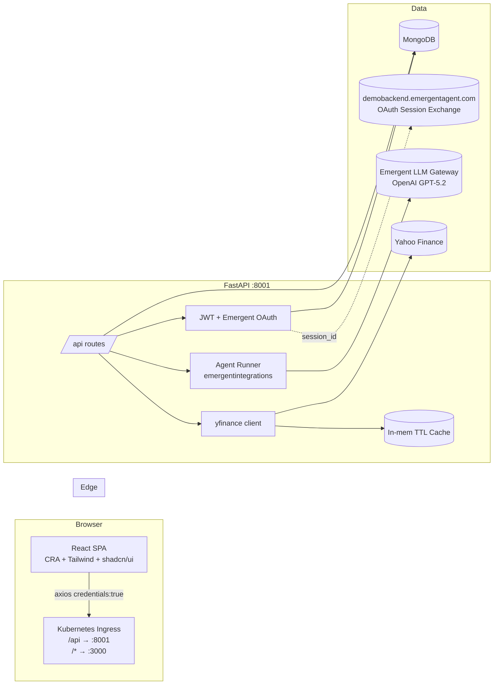
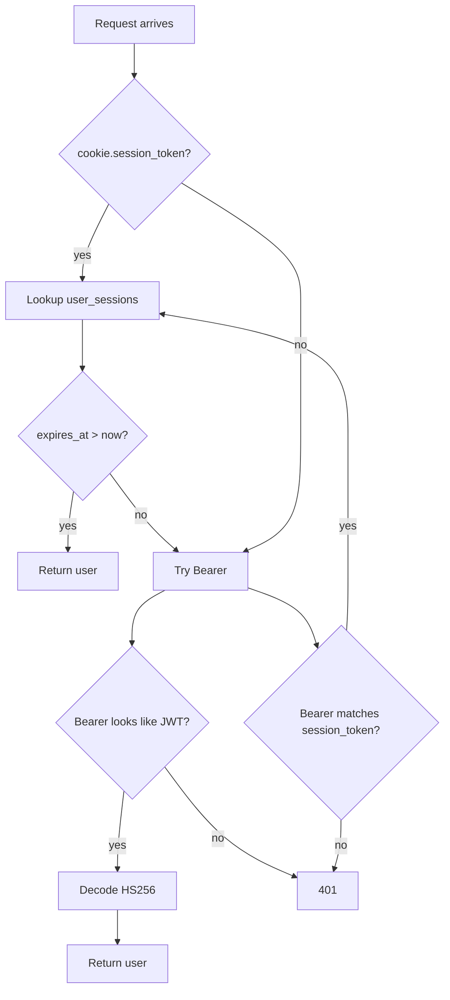
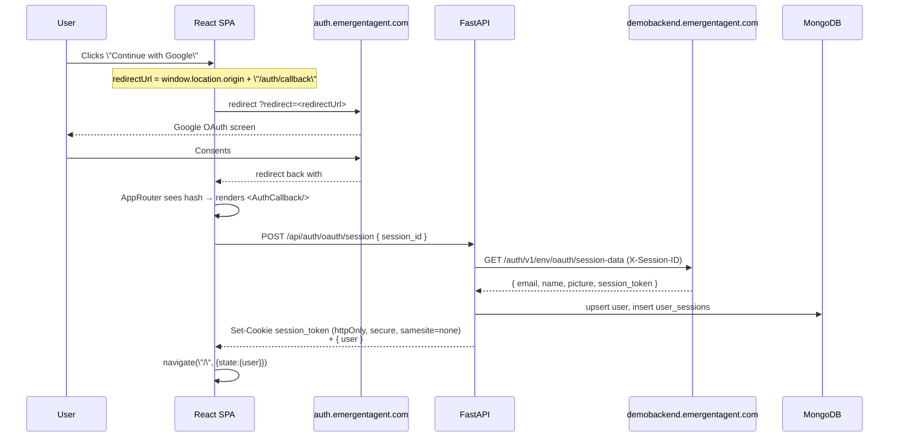
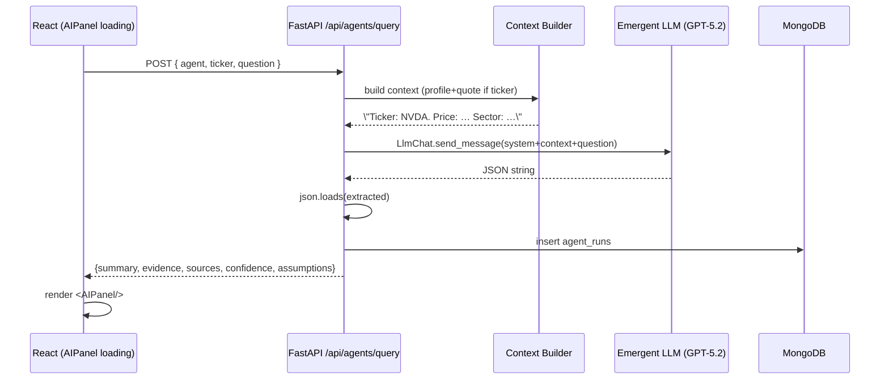
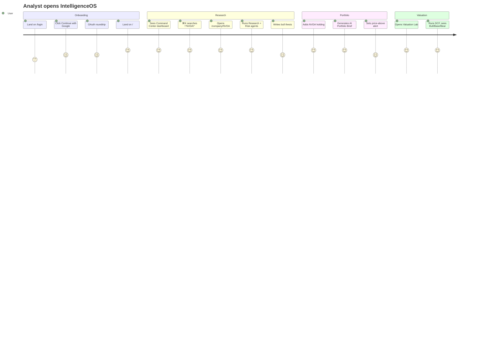

"# IntelligenceOS — Technical PRD & Architecture Guide

> **Version:** 1.0 · Template Project
> **Stack:** FastAPI + React (CRA + Tailwind + shadcn/ui) + MongoDB + Emergent LLM (GPT‑5.2)
> **Purpose:** AI investment intelligence platform with 7 specialized agents, market data, portfolio, valuation, screeners, RAG documents, knowledge graph, and JWT + Google OAuth.

This document is the single source of truth for the codebase. It covers architecture, data flow, agent prompts, every screen, every API, env config, and how to extend the template.

---

## 1. Product Overview

### 1.1 What it is
IntelligenceOS is a Bloomberg-terminal-inspired dark-theme web app that lets analysts:
- Monitor real-time market data (indices, sectors, tickers)
- Research any company (financials, news, thesis)
- Query 7 specialized AI agents that return `Summary + Evidence + Sources + Confidence + Assumptions`
- Build a portfolio and get an AI daily brief
- Run natural-language screeners
- Run DCF valuation with Bull/Base/Bear scenarios
- Upload PDF/text documents and ask questions (RAG-lite)
- Explore a company knowledge graph via React Flow
- Manage team members and see subscription tiers (Stripe stubbed)

### 1.2 Target Users
| Persona | Need |
|---|---|
| Retail power user | Deep research, evidence-backed thesis, watchlists |
| Analyst | Bulk company workspace, notebook, agent orchestration, exports |
| Small fund PM | Portfolio intel, health score, valuation lab, alerts |

### 1.3 Non-goals (v1)
- Live streaming quotes over WebSocket (cache-based instead)
- Real Stripe billing (UI only)
- Multi-region deployment
- Team invite emails (Resend/SendGrid) — later

---

## 2. High-Level Architecture



**Key principles**
- Backend routes are all prefixed `/api` (ingress rule).
- Frontend uses `process.env.REACT_APP_BACKEND_URL` (no localhost).
- Mongo access via `MONGO_URL` + `DB_NAME` only.
- No secrets in code — everything in `.env`.

---

## 3. Repository Layout

```
/app
├── backend/
│   ├── server.py            # Single FastAPI app, all routes
│   ├── requirements.txt
│   └── .env                 # MONGO_URL, DB_NAME, JWT_SECRET, EMERGENT_LLM_KEY
├── frontend/
│   ├── package.json
│   ├── tailwind.config.js   # Custom terminal theme, JetBrains Mono
│   ├── src/
│   │   ├── App.js           # Router (public + protected)
│   │   ├── index.css        # Design tokens + scrollbar + fonts
│   │   ├── lib/api.js       # Axios instance (credentials + JWT)
│   │   ├── contexts/AuthContext.jsx
│   │   ├── components/
│   │   │   ├── Layout.jsx         # Sidebar + topbar shell
│   │   │   ├── CommandPalette.jsx # ⌘K
│   │   │   ├── AIPanel.jsx        # Summary/Evidence/Sources/Confidence/Assumptions
│   │   │   ├── ProtectedRoute.jsx
│   │   │   └── ui/                # shadcn primitives
│   │   └── pages/
│   │       ├── Login.jsx          # login + signup + Google OAuth
│   │       ├── AuthCallback.jsx   # exchanges session_id → cookie
│   │       ├── CommandCenter.jsx  # Home dashboard
│   │       ├── Markets.jsx
│   │       ├── CompanyDetail.jsx  # workspace with 7 agents, tabs
│   │       ├── Portfolio.jsx
│   │       ├── Research.jsx       # notebook
│   │       ├── AIAgents.jsx       # agent playground
│   │       ├── Screeners.jsx
│   │       ├── Valuation.jsx      # DCF
│   │       ├── Documents.jsx      # upload + RAG-lite
│   │       ├── Alerts.jsx
│   │       ├── KnowledgeGraph.jsx # React Flow
│   │       ├── Team.jsx
│   │       └── Settings.jsx       # subscription tiers UI
│   └── .env                 # REACT_APP_BACKEND_URL
├── design_guidelines.json   # Design system spec
├── auth_testing.md          # Auth test playbook
└── memory/PRD.md
```

---

## 4. Environment Variables

### 4.1 `/app/backend/.env`
| Key | Purpose | Example |
|---|---|---|
| `MONGO_URL` | Mongo connection | `mongodb://localhost:27017` |
| `DB_NAME` | Database name | `test_database` |
| `CORS_ORIGINS` | Allowed origins | `*` |
| `JWT_SECRET` | HS256 sign secret | random 64-char |
| `EMERGENT_LLM_KEY` | Universal LLM key | `sk-emergent-…` |

### 4.2 `/app/frontend/.env`
| Key | Purpose |
|---|---|
| `REACT_APP_BACKEND_URL` | Public backend URL (must include https, no trailing slash) |
| `WDS_SOCKET_PORT` | HMR socket (Kubernetes) |

**Never** hardcode URLs or fallbacks — the Emergent OAuth flow relies on `window.location.origin` and `process.env.REACT_APP_BACKEND_URL`.

---

## 5. MongoDB Collections

| Collection | Fields | Notes |
|---|---|---|
| `users` | `user_id` (uuid), `email`, `name`, `password_hash`, `role`, `plan`, `picture`, `created_at` | `_id` never exposed; queries always project `{_id: 0}` |
| `user_sessions` | `user_id`, `session_token`, `expires_at` (iso), `created_at` | Emergent OAuth sessions (7-day TTL) |
| `watchlists` | `user_id`, `tickers[]`, `updated_at` | One doc per user |
| `holdings` | `holding_id`, `user_id`, `ticker`, `shares`, `cost_basis`, `created_at` | |
| `notes` | `note_id`, `user_id`, `title`, `content`, `ticker`, timestamps | Research notebook |
| `theses` | `thesis_id`, `user_id`, `ticker`, `stance` (bull/base/bear), `thesis`, `evidence[]`, `created_at` | |
| `alert_rules` | `rule_id`, `user_id`, `ticker`, `condition`, `value`, `note`, `active` | |
| `documents` | `doc_id`, `user_id`, `filename`, `text` (≤200KB), `size`, `created_at` | RAG source |
| `agent_runs` | `run_id`, `user_id`, `agent`, `ticker`, `question`, `result`, `created_at` | Audit trail |

**All datetimes** use `datetime.now(timezone.utc)`; stored as ISO strings; parsed back with `datetime.fromisoformat`.

---

## 6. Authentication

### 6.1 Two modes, one identity
1. **JWT email/password** — bcrypt hashes, HS256 JWT (7d), sent as `Authorization: Bearer <token>` (localStorage).
2. **Emergent Google OAuth** — session cookie flow via `demobackend.emergentagent.com`.

### 6.2 `get_current_user()` resolution order


### 6.3 Google OAuth end-to-end


**Critical rules (do not violate)**
- `redirect_url` derived from `window.location.origin` — **no fallbacks**, **no hardcoding**.
- Session cookie: `httponly=True, secure=True, samesite=\"none\", path=\"/\"`.
- `AuthCallback` uses `useRef` (not state) for `hasProcessed` — prevents StrictMode double-fire.
- `AuthProvider.checkAuth()` is skipped when the URL hash contains `session_id=` (otherwise a race with the callback returns 401).

---

## 7. Backend API Reference (all under `/api`)

### 7.1 Auth
| Method | Path | Body | Returns |
|---|---|---|---|
| POST | `/auth/signup` | `{email,password,name}` | `{token, user}` |
| POST | `/auth/login` | `{email,password}` | `{token, user}` |
| POST | `/auth/oauth/session` | `{session_id}` | `{user, session_token}` + Set-Cookie |
| GET | `/auth/me` | — | current user |
| POST | `/auth/logout` | — | clears cookie + session |

### 7.2 Market Data (all authenticated)
| Method | Path | Purpose |
|---|---|---|
| GET | `/market/overview` | Indices + 11 sector ETFs |
| GET | `/market/quote/{ticker}` | Single quote |
| GET | `/market/quotes?tickers=A,B` | Bulk quotes |
| GET | `/market/history/{ticker}?period=1mo` | OHLCV list |
| GET | `/market/brief` | AI Market Brief (runs `market_brief` agent) |
| GET | `/search?q=` | Universal ticker search |

### 7.3 Company
| Method | Path | Purpose |
|---|---|---|
| GET | `/company/{ticker}/profile` | Sector, industry, PE, betas, 52w range |
| GET | `/company/{ticker}/financials` | Income / Balance / Cash Flow (4 periods) |
| GET | `/company/{ticker}/news` | Yahoo Finance news |

### 7.4 Watchlist
| Method | Path | Body |
|---|---|---|
| GET | `/watchlist` | — |
| POST | `/watchlist/add` | `{ticker}` |
| POST | `/watchlist/remove` | `{ticker}` |

### 7.5 Portfolio
| Method | Path | Notes |
|---|---|---|
| GET | `/portfolio` | Returns holdings, KPIs, health_score (0–100) |
| POST | `/portfolio/add` | `{ticker, shares, cost_basis}` |
| DELETE | `/portfolio/{holding_id}` | |
| GET | `/portfolio/brief` | AI Portfolio Brief |

### 7.6 Notes / Thesis / Alerts
| Method | Path | Notes |
|---|---|---|
| GET/POST/PUT/DELETE | `/notes[/{id}]` | Rich text notes |
| GET | `/thesis/{ticker}` | List theses |
| POST | `/thesis` | `{ticker, stance, thesis, evidence[]}` |
| GET | `/alerts` | Rules + fires |
| POST | `/alerts` | Rule body |
| DELETE | `/alerts/{rule_id}` | |

### 7.7 AI Agents
| Method | Path | Body |
|---|---|---|
| POST | `/agents/query` | `{agent, ticker?, question}` |

### 7.8 Screener / Valuation / Graph / Documents / Team
| Method | Path | Notes |
|---|---|---|
| POST | `/screener/run` | NL query + filters |
| POST | `/valuation/dcf` | Full DCF inputs |
| GET | `/graph/{ticker}` | React Flow nodes/edges |
| POST | `/documents/upload` (multipart) | PDF/txt |
| GET | `/documents` | List |
| POST | `/documents/{id}/ask` | `{question}` |
| GET | `/team/members` | List users |

---

## 8. AI Agent System

### 8.1 The 9 agents
Defined in `AGENT_SYSTEM` dict in `server.py`:

| Key | Role |
|---|---|
| `research` | Senior equity research analyst |
| `financial` | CFA financial analyst (ratios, quality of earnings) |
| `news` | News impact analyst (materiality, sentiment) |
| `competitor` | Competitive strategy (Porter, moat) |
| `risk` | Risk analyst (tail risks, mitigations) |
| `valuation` | DCF / comps / scenario logic |
| `macro` | Macro strategist |
| `market_brief` | Daily market strategist |
| `portfolio_brief` | Portfolio daily brief |

### 8.2 Unified structured output contract
Every agent is forced (via appended system instruction) to return **strict JSON**:
```json
{
  \"summary\": \"2–4 sentences\",
  \"evidence\": [\"point 1\", \"point 2\"],
  \"sources\": [\"yfinance\", \"SEC 10-K\"],
  \"confidence\": 0-100,
  \"assumptions\": [\"assumes stable macro\", ...]
}
```
This drives the reusable `<AIPanel/>` UI with 5 tabs.

### 8.3 `run_agent()` internals
```python
chat = LlmChat(
    api_key=EMERGENT_LLM_KEY,
    session_id=f\"{agent_key}-{uuid.uuid4().hex[:8]}\",
    system_message=AGENT_SYSTEM[agent_key] + JSON_INSTRUCTION,
).with_model(\"openai\", \"gpt-5.2\")
reply = await chat.send_message(UserMessage(text=full_prompt))
# extract JSON substring between first '{' and last '}'
parsed = json.loads(extracted)
```
- Uses `emergentintegrations.llm.chat.LlmChat`.
- Session IDs are per-call (no cross-run memory).
- Every run is persisted to `agent_runs` for audit.
- Failures return a graceful stub with `confidence=0`.

### 8.4 Agent invocation flow


### 8.5 Adding a new agent
1. Add key + description to `AGENT_SYSTEM`.
2. If it needs specific context, extend `agents_query()`.
3. Frontend: add to `AGENTS` list in `AIAgents.jsx` and (optionally) `CompanyDetail.jsx`.
No new endpoint needed.

---

## 9. Screen-by-Screen Guide

### 9.1 Layout Shell (`Layout.jsx`)
Fixed left sidebar (`w-56`, `bg-panel`, `border-r`) + top bar (`h-14`, backdrop-blur).
Sidebar routes: Command Center, Markets, Portfolio, Research, AI Agents, Screeners, Valuation Lab, Documents, Alerts, Knowledge Graph, Team, Settings.
Top bar hosts the ⌘K trigger and the live market ticker indicator.

### 9.2 Command Center (`/`)
Widgets:
- Indices strip (5 tiles)
- SPY 1M line chart (recharts)
- Sector heatmap (11 sectors, centered zero-line bars)
- Watchlist table (click a row → `/company/:ticker`)
- AI Market Brief (button-triggered → calls `/market/brief`)

### 9.3 Markets (`/markets`)
Search + indices table + sectors table.

### 9.4 Company Detail (`/company/:ticker`)
Header: ticker + name + sector chip + price + %change.
Six metric tiles: market cap, P/E, fwd P/E, div yield, beta, 52w range.
6M price chart.
Tabs: Overview · Financials · News · Agents · Thesis.
- **Agents tab** renders all 7 agents as parallel `AIPanel`s; each has a \"Run\" button.
- **Thesis tab** has stance selector (Bull/Base/Bear) + textarea + list of past theses.

### 9.5 Portfolio (`/portfolio`)
KPI strip (value, cost, gain, health score).
Holdings table + Recharts donut (allocation).
Daily AI Portfolio Brief.

### 9.6 Research Notebook (`/research`)
Two-column: notes list + editor (title + textarea). CRUD via `/notes`.

### 9.7 AI Agents Playground (`/agents`)
Left rail: 7 agent cards. Right: form (ticker + question) + `AIPanel`.

### 9.8 Screeners (`/screeners`)
NL query + filters (min cap, max PE, sector). Runs against a hardcoded UNIVERSE of 25 tickers (fast). Returns filtered rows + AI insight panel.

### 9.9 Valuation Lab (`/valuation`)
Full DCF form (revenue, growth, margin, WACC, terminal g, years, shares). Backend computes projections, terminal value, EV, fair value/share, and ±25% Bull/Bear scenarios.

### 9.10 Documents (`/documents`)
Upload PDF/txt → server extracts text via `pypdf` → stored in `documents` collection. Ask a question → server injects first 8k chars of doc as context to the `research` agent.

### 9.11 Alerts (`/alerts`)
Rule builder (ticker + condition + value). No background worker in v1 (add Celery later per PRD phase 6).

### 9.12 Knowledge Graph (`/graph`)
React Flow visualization. Input a ticker → server returns nodes (target + 6 peers + sector) with pre-computed radial positions.

### 9.13 Team (`/team`)
Lists all users. RBAC hooks exist (`user.role`) but enforcement is deferred.

### 9.14 Settings (`/settings`)
Account info + 4 subscription tiers (Free/Pro/Team/Enterprise). Upgrade buttons stub a toast: \"Stripe checkout will activate once keys are configured.\"

---

## 10. Data & Caching Strategy

### 10.1 yfinance caching
`_yf_cache` is a process-local dict with TTL:
| Key pattern | TTL |
|---|---|
| `quote:{TICKER}` | 60s |
| `hist:{TICKER}:{PERIOD}` | 300s |
| `profile:{TICKER}` | 3600s |
| `fin:{TICKER}` | 3600s |
| `news:{TICKER}` | 300s |

Rationale: yfinance is heavy + rate-limited; short TTLs keep the UI snappy without hammering Yahoo.

**Upgrade path (Phase 6):** replace with Redis and add a Celery beat scheduler for popular tickers.

### 10.2 Frontend state
- `@tanstack/react-query` provider is set up (in `index.js`) with 60s staleTime and no refetch-on-focus.
- Pages currently use `useEffect` + axios directly (simple). Move to `useQuery` when hitting >20 endpoints.

---

## 11. Design System (see `/app/design_guidelines.json`)

- **Fonts:** Inter (UI), JetBrains Mono (tickers/data)
- **Colors:**
  - Base `#090A0C` · Panel `#121418` · Surface hover `#1C1F26`
  - Border `#22262E` · Focus border `#4B5563`
  - Semantic: positive `#22C55E`, negative `#EF4444`, warning `#F59E0B`
  - Accent: terminal orange `#F97316`, AI insight indigo `#818CF8`
- **Radius:** `rounded-md` (6px) — no bubbles
- **Shadows:** none (invisible on dark)
- **AI panel:** Shadcn Tabs; active TabTrigger has `border-b-terminal`
- **Tables:** py-2 px-3, `border-b border-line`, hover `bg-surface`
- **Overline label:** uppercase, `text-[10px]`, `tracking-[0.2em]`, `text-muted-foreground`

Do **not** apply universal `transition: all` — target `opacity/transform/background-color` only.

---

## 12. Deployment Notes

- Backend binds `0.0.0.0:8001`, supervisor-managed. Don't change.
- Frontend is `craco start` on port 3000, HMR on `WDS_SOCKET_PORT=443`.
- Ingress: `/api/*` → 8001, `/*` → 3000.
- `sudo supervisorctl restart backend` only when `.env` changes or a new pip package.
- `yarn add` (never `npm`).

---

## 13. Testing Playbook

### 13.1 Curl smoke test (uses REACT_APP_BACKEND_URL)
```bash
API=$(grep REACT_APP_BACKEND_URL /app/frontend/.env | cut -d= -f2)
TOKEN=$(curl -s -X POST \"$API/api/auth/signup\" \
  -H \"Content-Type: application/json\" \
  -d '{\"email\":\"demo@int.os\",\"password\":\"password123\",\"name\":\"Demo\"}' \
  | python3 -c \"import sys,json;print(json.load(sys.stdin)['token'])\")
curl -s -H \"Authorization: Bearer $TOKEN\" \"$API/api/market/overview\" | jq '.indices[0]'
curl -s -H \"Authorization: Bearer $TOKEN\" -H \"Content-Type: application/json\" \
  -X POST \"$API/api/agents/query\" \
  -d '{\"agent\":\"research\",\"ticker\":\"NVDA\",\"question\":\"Summarize the bull case.\"}' | jq
```

### 13.2 Auth-gated Playwright bootstrap
See `/app/auth_testing.md` — create a synthetic user + session in mongo, set the `session_token` cookie in the Playwright context, then navigate.

### 13.3 Priority test matrix

| Area | Coverage |
|---|---|
| Auth | signup, login, JWT protected route, logout, OAuth callback happy path |
| Market data | overview, quote, history, search fuzzy |
| Company | profile, financials, news, thesis save |
| Agents | 7 agent keys × 1 ticker each; verify JSON contract |
| Portfolio | add/remove holding, KPIs, brief |
| Valuation | DCF with realistic inputs; scenario symmetry |
| Screener | filter combos + NL query |
| Documents | upload PDF, ask question |
| Graph | fetch AAPL, verify 8 nodes |
| CMD+K | search, keyboard shortcut |

---

## 14. End-to-End User Journey (mermaid)



---

## 15. Roadmap / Backlog

### P0 (before real users)
- Rate-limit LLM per user
- Move `_yf_cache` to Redis
- Wire alert evaluator (Celery beat)
- Add error boundaries in React

### P1 (feature depth)
- Real earnings transcripts (Finnhub free tier)
- SEC EDGAR full-text search
- PDF/DOCX report export (WeasyPrint / python-docx)
- Approval workflow (Draft → Review → Approved → Published)

### P2 (monetization + ops)
- Live Stripe (checkout + webhooks + gating)
- Team invites via Resend
- Structured logs → Grafana
- Multi-region deploy

---

## 16. How to Extend This Template

### 16.1 Add a new backend endpoint
1. Add a Pydantic model + `@api.<verb>(\"/…\")` handler in `server.py`.
2. Depend on `get_current_user` for auth.
3. Use `db.<collection>.…` with `{_id: 0}` projection.
4. Store datetimes as ISO strings.

### 16.2 Add a new page
1. Create `src/pages/MyPage.jsx`.
2. Add a `<Route>` inside the protected block in `App.js`.
3. Add a sidebar entry in `Layout.jsx` NAV list.
4. Add a data-testid attribute to every interactive element.

### 16.3 Add a new integration
Always route through `integration_playbook_expert_v2` — never wing it. Add env vars only, never hardcode keys.

---

## 17. Known Limitations (be honest with users)

- yfinance is unofficial and can rate-limit or return stale data.
- Confidence scores are LLM self-reported, not calibrated.
- RAG is single-doc (no vector store yet).
- Alerts are stored but not evaluated in a background worker (Phase 6).
- Knowledge Graph uses a small hardcoded peer map for demo tickers; others fall back to a generic triplet.

---

## 18. Support & Ownership

| Area | Files | Notes |
|---|---|---|
| Auth | `server.py::get_current_user`, `AuthContext`, `AuthCallback` | Any change requires re-running auth tests |
| Agents | `server.py::AGENT_SYSTEM`, `run_agent`, `AIPanel` | Contract change touches every panel |
| Design | `design_guidelines.json`, `tailwind.config.js`, `index.css` | Don't add gradients on dark surfaces |
| Data | Mongo collections in §5 | Never expose `_id` |

---

## 19. Appendix — Full Agent Prompts

Base contract (appended to every agent):
> \"You MUST respond in strict JSON with these keys: summary (string, 2-4 sentences), evidence (array of strings), sources (array of strings), confidence (number 0-100), assumptions (array of strings). No markdown. Only JSON.\"

Per-agent system messages:
```
research:        \"You are a senior equity research analyst. Provide a concise, structured analysis with clear reasoning.\"
financial:       \"You are a CFA financial analyst. Focus on financials, ratios, and quality of earnings.\"
news:            \"You are a news impact analyst. Focus on materiality, sentiment, and affected entities.\"
competitor:      \"You are a competitive strategy analyst (Porter's Five Forces, moat analysis).\"
risk:            \"You are a risk analyst. Identify key risks, tail risks, and mitigations.\"
valuation:       \"You are a valuation expert. Explain DCF, comps, and scenario logic.\"
macro:           \"You are a macro strategist. Explain macro impacts on the given asset.\"
market_brief:    \"You are a market strategist writing the AI Market Brief.\"
portfolio_brief: \"You are a portfolio strategist writing a daily portfolio brief.\"
```

Context templates:
- **Company agents:** `\"Ticker: {T}. Company: {name}. Sector: {sector}. Price: {price}. Summary: {longBusinessSummary[:800]}\"`
- **Market Brief:** `\"Market Indices: {label} {chg}%...\"`
- **Portfolio Brief:** `\"Portfolio value: $X, gain: Y%. Holdings: TICKER(alloc%),...\"`
- **Documents:** `\"Document '{filename}':
{text[:8000]}\"`

---

*End of document. Version 1.0 — keep in sync with `/app/memory/PRD.md`.*
"